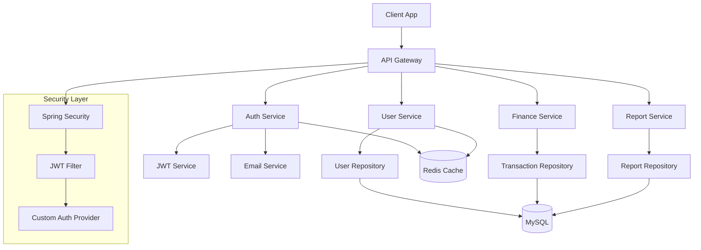

# 💰 MoneyMentor - Smart Financial Guide

<div align="center">


**A complete and intelligent financial management system for controlling expenses and income**

[](https://spring.io/projects/spring-boot)
[](https://kotlinlang.org/)
[](https://openjdk.java.net/)
[](https://www.mysql.com/)
[](https://redis.io/)
[](https://jwt.io/)

</div>

---

## 🎯 About MoneyMentor

**MoneyMentor** is an advanced financial management platform that helps you:

- 💳 **Easily manage your expenses and income**
- 📊 **Get comprehensive and understandable financial reports**
- 🎯 **Set financial goals and track your progress**
- 🔐 **Keep your financial information secure with the highest security**
- 📱 **Access your accounts anytime, anywhere**

---

## ✨ Key Features

### 🔐 Secure Authentication System
- **Secure registration and login** with JWT Token
- **Email verification** to ensure information accuracy
- **Password recovery** via email
- **Two-factor authentication** (2FA) for enhanced security
- **User session management** with Redis

### 👤 User Management
- **Complete user profile** with personal information
- **Role management** (regular user, premium, business)
- **Personalization settings** (language, currency, timezone)
- **Activity history** and security logs

### 💰 Financial Management (In Development)
- **Financial transaction recording** (income and expenses)
- **Transaction categorization** for better analysis
- **Monthly and annual budgeting**
- **Financial goals** and progress tracking
- **Financial alerts** for unnecessary expenses

### 📊 Reporting and Analytics
- **Detailed reports** on income and expenses
- **Interactive charts** for displaying financial trends
- **Expense analysis** by category
- **Financial forecasting** based on past patterns
- **Report export** in various formats

### 🔧 Technical Features
- **RESTful API** for integration with other applications
- **Redis cache** for improved performance
- **MySQL database** for secure storage
- **Microservice ready** for scalability
- **Docker** for easy deployment

---

## 🛠️ Technologies Used

### Backend
- **Spring Boot 3.5.6** - Main framework
- **Kotlin 1.9.25** - Programming language
- **Spring Security** - Security and authentication
- **Spring Data JDBC** - Database access
- **JWT (JSON Web Tokens)** - Stateless authentication

### Database & Cache
- **MySQL 8.0** - Main database
- **Redis 7.0** - Cache and session management

### Infrastructure
- **Docker** - Containerization
- **Maven** - Dependency management
- **Actuator** - System monitoring and health

---

## 🚀 Installation & Setup

### Prerequisites
- Java 21 or higher
- Maven 3.6+
- MySQL 8.0+
- Redis 7.0+
- Docker (optional)

### Setup with Docker (Recommended)

```bash
# Clone the project
git clone https://github.com/your-username/MoneyMentor.git
cd MoneyMentor

# Setup with Docker Compose
docker-compose up -d
```

### Manual Setup

```bash
# 1. Clone the project
git clone https://github.com/your-username/MoneyMentor.git
cd MoneyMentor

# 2. Create database
mysql -u root -p < sql/init.sql

# 3. Setup Redis
redis-server --port 6381

# 4. Run the application
./mvnw spring-boot:run
```

### Environment Configuration

Edit the `application.properties` file:

```properties
# Database settings
spring.datasource.url=jdbc:mysql://localhost:3308/moneymentor
spring.datasource.username=root
spring.datasource.password=password

# Redis settings
spring.data.redis.host=localhost
spring.data.redis.port=6381

# Email settings (for email verification)
spring.mail.host=smtp.gmail.com
spring.mail.username=your-email@gmail.com
spring.mail.password=your-app-password
```

---

## 📡 API Documentation

### Authentication Endpoints

| Method | Endpoint | Description |
|--------|----------|-------------|
| `POST` | `/api/auth/register` | Register new user |
| `POST` | `/api/auth/login` | User login |
| `POST` | `/api/auth/refresh` | Token refresh |
| `POST` | `/api/auth/logout` | User logout |
| `POST` | `/api/auth/forgot-password` | Forgot password |
| `POST` | `/api/auth/reset-password` | Reset password |
| `POST` | `/api/auth/verify-email` | Email verification |
| `GET` | `/api/auth/me` | Current user info |

### API Usage Examples

#### Register New User
```bash
curl -X POST http://localhost:8080/api/auth/register \
  -H "Content-Type: application/json" \
  -d '{
    "username": "user123",
    "email": "user@example.com",
    "password": "SecurePass123!",
    "firstName": "John",
    "lastName": "Doe"
  }'
```

#### User Login
```bash
curl -X POST http://localhost:8080/api/auth/login \
  -H "Content-Type: application/json" \
  -d '{
    "username": "user123",
    "password": "SecurePass123!"
  }'
```

---

## 🏗️ System Architecture



---

## 📊 Database Structure

### Users Table
Main user table with complete information including:
- Personal information (name, email, mobile number)
- Security settings (2FA, last login date)
- Personalization settings (language, currency, timezone)
- User status management (active, inactive, suspended)

---

## 🔒 Security

- **Password encryption** with BCrypt
- **JWT Token** for stateless authentication
- **Rate Limiting** to prevent brute force attacks
- **CORS** configured for cross-origin security
- **SQL Injection Protection** with prepared statements
- **XSS Protection** on all endpoints

---

## 🧪 Testing

```bash
# Run all tests
./mvnw test

# Run specific tests
./mvnw test -Dtest=AuthServiceTest

# Test with coverage
./mvnw test jacoco:report
```

---

## 📈 Performance & Monitoring

- **Actuator Endpoints** for system health monitoring
- **Redis Cache** for improved performance
- **Connection Pooling** for database optimization
- **Comprehensive Logging** for debug and monitoring

---

## 🤝 Contributing

We welcome your contributions! Please:

1. Fork the repository
2. Create a new branch (`git checkout -b feature/AmazingFeature`)
3. Commit your changes (`git commit -m 'Add some AmazingFeature'`)
4. Push to the branch (`git push origin feature/AmazingFeature`)
5. Open a Pull Request

---

## 📋 TODO List

### ✅ Completed
- [x] JWT authentication system
- [x] User management
- [x] Core APIs
- [x] Docker configuration

### 🚧 In Development
- [ ] Financial transaction management
- [ ] Reporting system
- [ ] User dashboard
- [ ] Mobile application

### 📅 Planned
- [ ] Smart expense analysis
- [ ] Financial alerts
- [ ] Financial goals
- [ ] Multi-currency support
- [ ] Bank integration

---

## 📞 Support

- **Email**: support@moneymentor.com
- **Telegram**: @MoneyMentorSupport
- **GitHub**: [Issues](https://github.com/your-username/MoneyMentor/issues)

---

## 📄 License

This project is licensed under the MIT License. See the [LICENSE](LICENSE) file for details.

---

<div align="center">

**Experience financial management with ease using MoneyMentor! 💰✨**


</div>
